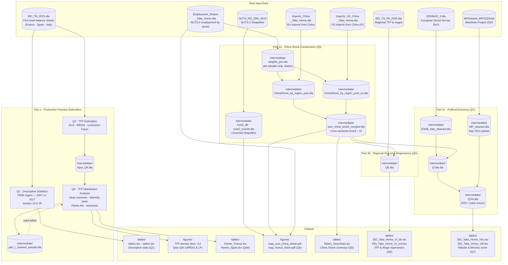

# 20269 Economics of European Integration - Final Report

[](https://opensource.org/licenses/MIT)

## Overview

This repository contains the complete analysis for the Economics of European Integration (20269) final report at Bocconi University. The project examines production function estimation, the China import shock on European regions, and its political economy implications.

## Collaborators

- **Stefano Graziosi** ([stfgrz](https://github.com/stfgrz))
- **Enrico Ancona**
- **Simone Donoghue**

## Repository Structure

```
20269-eei-report/
├── code/               # All Stata analysis code
│   ├── main_analysis.do      # Primary submission file (Problems 1-7)
│   └── tutorial/             # Course reference materials
├── data/               # Input datasets (organized by type)
│   ├── firm_level/           # Firm balance sheet data
│   ├── regional/             # Regional employment, ESS survey
│   ├── trade/                # China import data
│   ├── political/            # Manifesto Project data
│   └── shapefiles/           # NUTS-2 geographic boundaries
├── output/             # Generated results
│   ├── figures/              # Maps, density plots, RD plots
│   ├── tables/               # LaTeX/HTML regression tables
│   └── intermediate/         # Temporary datasets
├── docs/               # Assignment and references
│   ├── Take_Home_EEI_2025.pdf
│   └── references/           # Academic papers
├── archive/            # Deprecated drafts (DO NOT USE)
└── README.md           # This file
```

## Data Flow

The chart below shows which input datasets feed each problem, what intermediate files are produced, and what final outputs (tables and figures) are generated.



## Project Contents

### Part 1: Production Function Estimation (Problems 1-4)

**Problem 1:** Descriptive statistics for French textile and automotive firms (FR30 region, 2007 vs 2017)

**Problem 2:** Total Factor Productivity (TFP) estimation using:
- OLS (Cobb-Douglas)
- Wooldridge (WRDG) method with `prodest`
- Levinsohn-Petrin (LP) method with `levpet`

**Problem 3:** Theoretical discussion on revenues vs value added in production functions

**Problem 4:** TFP distribution analysis across sectors (textiles, automotive) and countries (France, Spain)

### Part 2: China Shock and Political Economy (Problems 5-7)

**Problem 5:** China import shock construction:
- Regional import exposure by NUTS-2 (1988-2007)
- Instrumental variable using US-China trade
- Mapping regional variation

**Problem 6:** Impact on regional outcomes:
- TFP and wage regressions
- Instrumental variable strategy (Colantone & Stanig 2018)
- First stage and reduced form results

**Problem 7:** Political implications:
- European Social Survey (ESS) analysis for Italy
- Attitudes toward renewable energy subsidies
- Party voting behavior and minority rights positions

## How to Run

### Prerequisites

**Software:**
- Stata 17 or higher (some commands require version 17+)
- Git (for cloning the repository)

**Required Stata Packages:**
```stata
ssc install outreg2, replace
ssc install estout, replace
ssc install levpet, replace
ssc install prodest, replace
ssc install spmap, replace
ssc install shp2dta, replace
ssc install ivreg2, replace
```

### Execution

1. **Clone the repository:**
   ```bash
   git clone https://github.com/stfgrz/20269-eei-report.git
   cd 20269-eei-report
   ```

2. **Open Stata and run the main analysis file:**
   ```stata
   do code/main_analysis.do
   ```

3. **Output will be generated in:**
   - `output/figures/` - All graphs and maps
   - `output/tables/` - All regression tables
   - `output/intermediate/` - Intermediate datasets

### Configuration

The script automatically detects your username and sets paths. If you encounter path issues, edit lines 59-77 in `code/main_analysis.do` to add your username and preferred path.

## Data Sources

- **Firm-level data**: Course materials (EEI_TH_2025.dta)
- **Regional statistics**: Eurostat (employment shares, NUTS boundaries)
- **Trade data**: UN Comtrade (Chinese imports to EU and US)
- **Survey data**: European Social Survey Round 8 (2016)
- **Political data**: Manifesto Project (MARPOR 2024)

See `data/README.md` for detailed data documentation.

## Key Results

### Production Function Estimates
Comparison of TFP estimation methods shows:
- WRDG and LP methods produce more reasonable coefficients than OLS
- Significant sectoral differences between textiles and automotive
- Cross-country variation in productivity distributions

### China Shock Analysis
Regional exposure to Chinese import competition:
- Strong geographic heterogeneity (North-South divide)
- Negative impact on regional wages and TFP
- IV estimates larger than OLS (suggesting attenuation bias)

### Political Economy
- Regions with higher China shock exposure show more negative attitudes toward renewable energy subsidies
- Effect operates partly through voting for parties with less favorable positions on minority rights

## File Naming Convention

- **Code files:** lowercase with underscores (e.g., `main_analysis.do`)
- **Data files:** PascalCase with underscores (e.g., `Employment_Shares_Take_Home.dta`)
- **Output files:** descriptive names with type prefix (e.g., `Figure1_firm_size_density_2007.pdf`, `Table1_DescStats.tex`)

## Notes

- The `archive/` directory contains deprecated draft versions. **Do not use these files.**
- All paths in the code use global variables for portability
- Output files are overwritten when the script runs
- Some data files are loaded from GitHub URLs for reproducibility

## License

This project is licensed under the MIT License - see the [LICENSE](LICENSE) file for details.

## Acknowledgments

- Course instructors and TAs for Economics of European Integration (20269)
- Colantone & Stanig (2018) for the empirical strategy
- Data providers: Eurostat, UN Comtrade, ESS, Manifesto Project

## Contact

For questions about this analysis, please contact the collaborators through GitHub:
- Stefano Graziosi: [@stfgrz](https://github.com/stfgrz)
